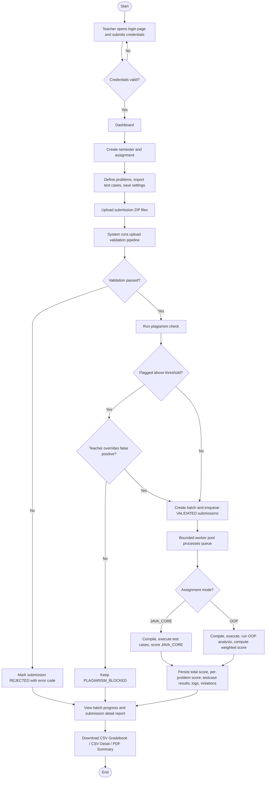

# Activity Diagram

## Main Teacher Workflow

## Activity checkpoints
- Upload immediately triggers validation.
- Plagiarism is a gate before grading.
- Batch grading is asynchronous.
- Both grading modes converge at the same persistence and reporting stage.
