# Class And Module Diagram

## MVC + Layered Structure

```mermaid
classDiagram
    class DashboardController
    class AssignmentController
    class SubmissionController
    class PlagiarismController
    class BatchController
    class ReportController

    class SemesterService
    class AssignmentService
    class SubmissionService
    class PlagiarismService
    class BatchService
    class ReportService

    class SemesterRepository
    class AssignmentRepository
    class ProblemRepository
    class TestCaseRepository
    class SubmissionRepository
    class BatchRepository
    class ReportExportRepository

    class Assignment
    class Problem
    class TestCase
    class Submission
    class Batch
    class ProblemResult
    class TestCaseResult
    class OopViolation

    class GradingFacade
    class ReportFacade
    class RuleCheckerFactory

    class GradingPipeline {
        +gradeSubmission(context)
        #compile()
        #execute()
        #score()
        #persist()
    }

    class GradingContext

    class GradingStrategy {
        <<interface>>
        +grade(context)
    }

    class CoreGradingStrategy
    class OopGradingStrategy

    class OutputComparisonStrategy {
        <<interface>>
        +matches(expected, actual)
    }

    class NormalizedOutputComparisonStrategy

    class PlagiarismStrategy {
        <<interface>>
        +compare(submissions)
    }

    class AstFingerprintPlagiarismStrategy

    class OopRuleChecker {
        <<interface>>
        +check(ast)
    }

    class PrivateFieldRuleChecker
    class GetterSetterRuleChecker
    class InheritanceRuleChecker
    class OverrideRuleChecker

    DashboardController --> SemesterService
    AssignmentController --> AssignmentService
    SubmissionController --> SubmissionService
    PlagiarismController --> PlagiarismService
    BatchController --> BatchService
    ReportController --> ReportService

    SemesterService --> SemesterRepository
    AssignmentService --> AssignmentRepository
    AssignmentService --> ProblemRepository
    AssignmentService --> TestCaseRepository
    SubmissionService --> SubmissionRepository
    BatchService --> BatchRepository
    ReportService --> ReportExportRepository

    BatchService --> GradingFacade
    ReportService --> ReportFacade
    PlagiarismService --> PlagiarismStrategy
    GradingFacade --> GradingStrategy

    GradingStrategy <|.. CoreGradingStrategy
    GradingStrategy <|.. OopGradingStrategy
    GradingPipeline <|-- CoreGradingStrategy
    GradingPipeline <|-- OopGradingStrategy

    OutputComparisonStrategy <|.. NormalizedOutputComparisonStrategy
    PlagiarismStrategy <|.. AstFingerprintPlagiarismStrategy

    RuleCheckerFactory --> OopRuleChecker
    OopRuleChecker <|.. PrivateFieldRuleChecker
    OopRuleChecker <|.. GetterSetterRuleChecker
    OopRuleChecker <|.. InheritanceRuleChecker
    OopRuleChecker <|.. OverrideRuleChecker

    AssignmentService --> Assignment
    Assignment --> Problem
    Problem --> TestCase
    SubmissionService --> Submission
    BatchService --> Batch
    GradingFacade --> GradingContext
    GradingFacade --> ProblemResult
    GradingFacade --> TestCaseResult
    OopGradingStrategy --> OopViolation
```

## Module responsibilities

### Presentation
- Controllers receive HTTP requests, bind form data, and choose Thymeleaf views.
- Controllers do not access repositories directly.

### Application
- Services orchestrate use cases and transaction boundaries.
- Facades provide a stable entry point for complex subsystems such as grading and reporting.

### Domain
- Entities hold business state.
- Strategy interfaces isolate mode-specific grading and plagiarism logic.

### Infrastructure
- Repositories persist aggregates.
- Storage adapters handle uploaded files, extracted sandboxes, logs, and exports.
- Compiler and execution adapters isolate external process handling.

## Pattern mapping
- `MVC`: controllers + Thymeleaf views
- `Repository`: persistence abstraction per aggregate
- `Strategy`: grading mode, plagiarism, output comparison
- `Template Method`: `GradingPipeline`
- `Factory`: `RuleCheckerFactory`
- `Facade`: `GradingFacade`, `ReportFacade`
