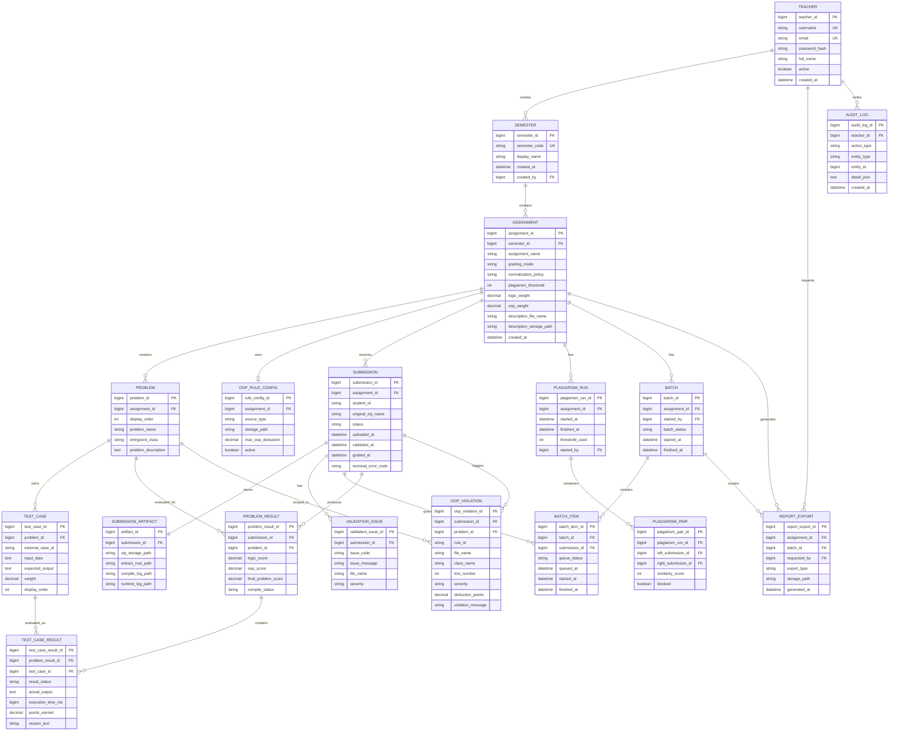

# ERD

## Logical Data Model

## ERD notes
- `Assignment` is the aggregate root for grading configuration.
- `Submission` is the aggregate root for uploaded student work and result lifecycle.
- `ProblemResult` and `TestCaseResult` preserve detailed grading evidence for reports.
- `AuditLog` is required for teacher override and other sensitive actions.
