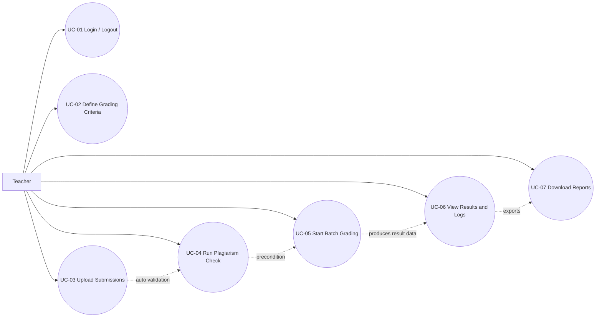

# Use Case Diagram

## Purpose
This diagram maps the single actor `Teacher` to the seven approved use cases in the SRS.

## Notes
- `UC-01` covers `FR-01..03`.
- `UC-02` covers semester, assignment, problem, test case, and OOP rule setup.
- `UC-03` includes automatic validation after upload.
- `UC-04` must run before `UC-05`.
- `UC-06` is read-only result inspection.
- `UC-07` generates CSV and PDF outputs from persisted results.
